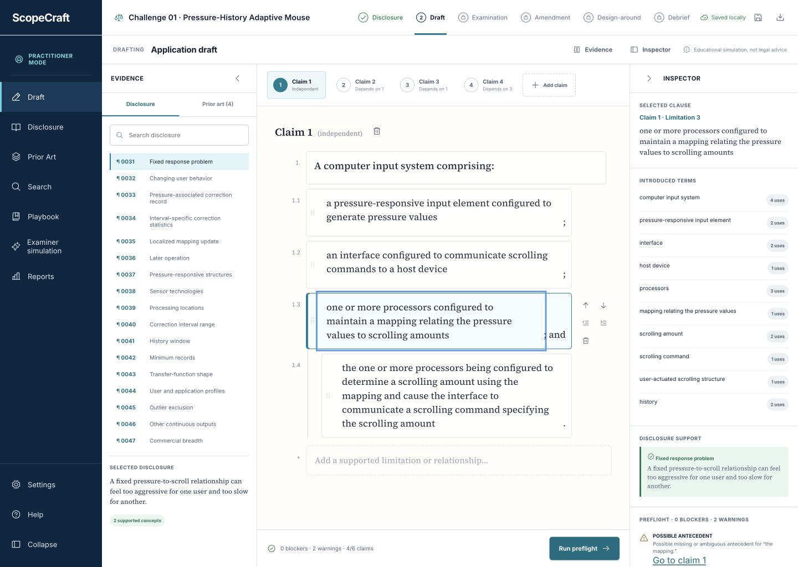

# ScopeCraft

ScopeCraft is an educational patent-claim drafting game. It turns a fictional invention disclosure into a structured exercise covering claim drafting, examination, amendment, design-around analysis, and debriefing.



## What is included

- Guided, Practitioner, and Examiner difficulty modes
- A structured independent and dependent claim editor
- Disclosure-support and prior-art evidence panels
- Mechanical claim preflight checks
- A deterministic examiner simulation bounded to the challenge record
- One Office Action response and amendment round
- A design-around prediction exercise
- A scored portfolio debrief
- A searchable drafting-guide library with concise workflows, examples, and checklists
- A downloadable, expanded practice library containing editable guides and worksheets
- Local browser persistence and JSON export
- Responsive desktop, tablet, and mobile layouts

Challenge 01 uses a fictional pressure-history adaptive mouse disclosure and links to public patent documents as frozen exercise references. The application stipulates reference availability solely for gameplay and does not ask players to determine statutory prior-art dates. Reference summaries are paraphrased and the repository does not embed full patent PDFs.

The current release contains one challenge. Evaluator rules, mappings, and target embodiments ship with the client-side source, so concealed material is a learning-interface mechanic rather than anti-cheat security.

## Drafting guides

The in-app Guides area covers application workflow, independent and dependent claims, Summary drafting, figure narratives, claim-set restructuring, drafting language, and quick-reference checks. It separates official U.S. legal and procedural baselines from practice suggestions and hypothetical examples. The downloadable library is available from the Guides hub.

## Educational boundary

ScopeCraft is an educational simulation, not legal advice. It does not provide a patentability, validity, infringement, noninfringement, or freedom-to-operate opinion. Results describe only what occurred under the challenge's configured facts, references, mappings, and evaluator rules.

## Privacy

ScopeCraft has no account system, analytics, or telemetry. Drafts are stored locally in the browser when supported. Exported attempt files contain game state, not account identifiers. The application makes outbound requests only when a player chooses to open a linked public patent record.

## Run locally

Requirements: Node.js 22.22.2, 24.15.0, 26.0.0, or a compatible later release, plus npm.

```sh
npm ci
npm run dev
```

## Verify

```sh
npm run check
```

The check runs the automated test suite, creates a production build, and validates the included static-hosting worker.

## Claim-editor keyboard controls

- Enter adds and focuses a sibling limitation.
- Shift+Enter inserts a line break.
- Tab and Shift+Tab change limitation depth while editing.
- Escape exits clause-editing mode and restores ordinary keyboard navigation.

## License

No open-source license has been selected. The source is publicly viewable, but no permission to copy, modify, or redistribute it is granted by this repository.
