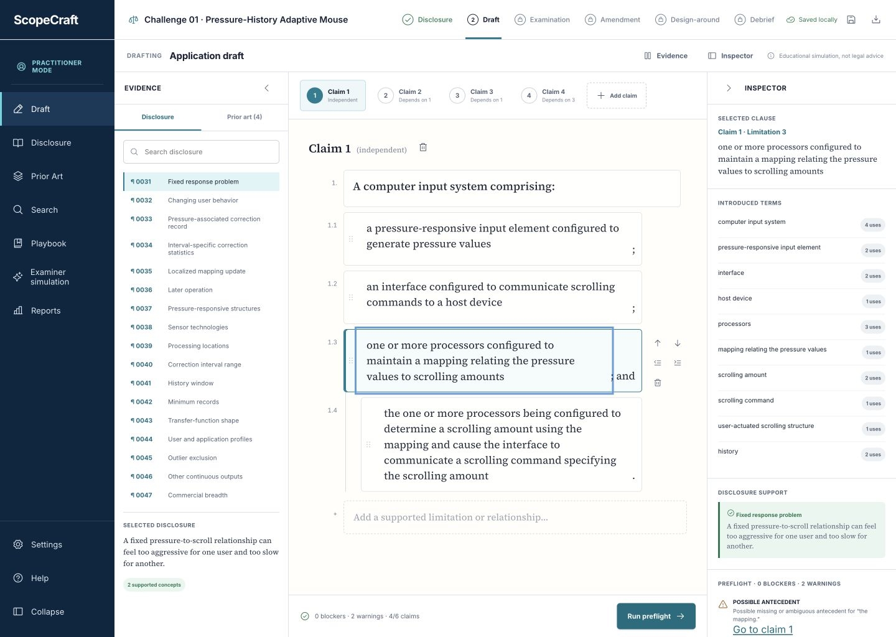

# ScopeCraft

ScopeCraft is an educational patent-claim drafting game. It turns a fictional invention disclosure into a structured exercise covering claim drafting, examination, amendment, design-around analysis, and debriefing.



## What is included

- Guided, Practitioner, and Examiner difficulty modes
- A structured independent and dependent claim editor
- Disclosure-support and prior-art evidence panels
- Mechanical claim preflight checks
- A deterministic examiner simulation bounded to the challenge record
- One Office Action response and amendment round
- A design-around prediction exercise
- A scored portfolio debrief
- A searchable drafting-guide library with concise workflows, examples, and checklists
- A downloadable, expanded practice library containing editable guides and worksheets
- Explicit local draft resume, session-only use, deletion, and JSON export
- Responsive desktop, tablet, and mobile layouts

Challenge 01 uses a fictional pressure-history adaptive mouse disclosure and links to public patent documents as frozen exercise references. The application stipulates reference availability solely for gameplay and does not ask players to determine statutory prior-art dates. Reference summaries are paraphrased and the repository does not embed full patent PDFs.

The current release contains one challenge. Evaluator rules, mappings, and target embodiments ship with the client-side source, so concealed material is a learning-interface mechanic rather than anti-cheat security.

## Reviewed challenge content

The playable challenge follows a reviewed-content promotion path:

1. Keep nonpublic candidate drafts outside the release inputs. Local operator candidates may be kept under `ops/challenge-candidates/` with filenames ending in `.local`, which the repository already ignores. Confidential invention records, transcripts, and matter documents remain in their authorized Patent Law matter workspace and must not be copied into this public repository.
2. Complete human review and fictionalization before placing a candidate's public-safe player and evaluator records in `data/challenges/reviewed/`. A reviewed record must expressly identify completed review, fictionalization, public-release approval, and the saved-attempt compatibility hash. Any player or evaluator content change must advance both `contentVersion` and the matching compatibility hash so older saved attempts are not silently evaluated against different content.
3. Run `npm run challenges:generate` to validate the reviewed record and regenerate `src/challenges/generated/challenge01.generated.js`. The generated module omits review metadata and is the challenge data actually consumed by the application.
4. Run `npm run challenges:check` before building or publishing. Check mode is non-mutating and fails if the reviewed record is invalid, contains blocked confidential or credential material, or no longer matches the committed generated module.

Do not edit a generated challenge module by hand. Candidate ingestion never promotes content automatically, and neither candidate files nor the human-review record is copied into `dist/client`. The player-facing and evaluator objects remain separate in source and are combined only for the internal deterministic evaluator. Because the evaluator ultimately ships in the static client, all evaluator content must also be safe for public release.

The saved-attempt engine identity is generated from the engine's local source dependency graph. Run `npm run compatibility:generate` after an intentional engine change and commit the resulting `src/engine/generated/compatibility.generated.js`. `npm run compatibility:check` fails when the generated identity is stale. A challenge content digest and this engine digest are saved with each draft. Drafts created against older content remain available for explicit read-only review, but cannot silently create a new writable attempt with stale identities.

The downloadable practice library is governed separately by `data/downloads/reviewed-practice-library.json`. Its approved SHA-256 digest and complete ZIP entry inventory must match before a build can ship. CI also requires the same digest in the independently administered `PRACTICE_LIBRARY_APPROVED_SHA256` repository variable, so changing an archive and its checked-in manifest is not enough to publish it. Archive verification compares local and central ZIP metadata, rejects unsafe paths, links, active content, embedded objects, unapproved external relationships, decompression bombs, and malformed entry layouts, then recursively inspects PDF and Office document content. The final client verifier also rejects unexpected files, unhashed cacheable assets, local or confidential paths, credential patterns, non-HTTPS links, and URL hosts that have not been explicitly approved.

## Drafting guides

The in-app Guides area covers application workflow, independent and dependent claims, Summary drafting, figure narratives, claim-set restructuring, drafting language, and quick-reference checks. It separates official U.S. legal and procedural baselines from practice suggestions and hypothetical examples. The downloadable library is available from the Guides hub.

## Educational boundary

ScopeCraft is an educational simulation, not legal advice. It does not provide a patentability, validity, infringement, noninfringement, or freedom-to-operate opinion. Results describe only what occurred under the challenge's configured facts, references, mappings, and evaluator rules.

## Privacy

ScopeCraft has no account system, analytics, telemetry, backend, or database. Drafts can be stored locally in the browser when supported, but they are never restored or displayed automatically. A player must open **Saved drafts** and choose a record. Browser records expire after 90 days, are limited to the 20 most recently updated attempts, are bounded by per-record and total size limits, and can be deleted individually or in bulk. Session-only mode keeps new edits in the current tab without adding them to durable browser storage. Anyone using a shared browser profile should clear saved drafts before handing the profile to another person. Exported attempt files contain game state, not account identifiers. The application makes outbound requests only when a player chooses to open a reviewed public link.

## Run locally

Requirements: Node.js 24.18.1 and npm 12.0.2. The repository pins that exact production and CI toolchain in `.node-version`, `.nvmrc`, `package.json`, and the lockfile.

```sh
npm ci
npm run dev
```

## Build and host anywhere

```sh
export PRACTICE_LIBRARY_APPROVED_SHA256="<independently reviewed digest>"
npm run build
```

`dist/client` is ScopeCraft's canonical portable artifact. It contains the complete static application, guide-route shells, fonts, and downloadable practice library. Copy that directory as a unit to any static host. The normal build does not require `.openai/`, `worker/`, an OpenAI Sites project ID, authentication, or hosted runtime services.

For Nginx, point the TLS virtual host's document root at the deployed `dist/client` directory and fall back to `/index.html` for application routes. An example is included at `deploy/nginx.conf.example`; replace the example hostname and certificate paths with reviewed deployment values. Its plaintext host only redirects to HTTPS, unknown plaintext hosts are dropped, and unknown TLS handshakes are rejected. Never serve the JavaScript application directly over plaintext HTTP. Serve the application at the origin root, because its generated asset and guide links use root-relative URLs. Hashed files under `/assets/` may use a long immutable cache lifetime. Keep `index.html`, the guide-route shells, and the stable-name download on a short cache lifetime so new releases appear promptly.

ScopeCraft is a static site. It intentionally does not add `/healthz` or `/readyz`; monitor the existing HTTPS root or a release artifact instead. Do not add a resident service, authentication layer, backend, database, or artificial monitoring API solely for deployment checks.

### Optional OpenAI Sites mirror

The Sites deployment is an optional preview or mirror, not a requirement of the application. When `.openai/hosting.json` and `worker/index.js` are present, prepare its additional adapter files with:

```sh
npm run build:sites
```

That command first creates the same portable `dist/client` artifact, then adds `dist/server/index.js` and `dist/.openai/hosting.json` for Sites packaging. Those adapter files are not part of the portable application and the browser client does not rely on Sites headers, authentication routes, D1, R2, or worker runtime APIs.

## Verify

```sh
npm run check
npm run verify:download-approval
npm run audit
```

Every production build, `npm run check`, and `verify:download-approval` require `PRACTICE_LIBRARY_APPROVED_SHA256` to be supplied outside the checkout. The full check runs the application tests, proves a standalone build succeeds in an isolated copy with the Sites folders removed, checks the documented HTTPS-only Nginx routing contract, and validates the optional Sites build and worker.

## Claim-editor keyboard controls

- Enter adds and focuses a sibling limitation.
- Shift+Enter inserts a line break.
- Tab and Shift+Tab change limitation depth while editing.
- Escape exits clause-editing mode and restores ordinary keyboard navigation.

## License

No open-source license has been selected. The source is publicly viewable, but no permission to copy, modify, or redistribute it is granted by this repository.
